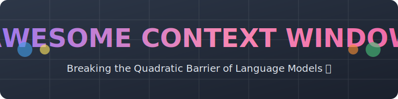

<!-- SEO Meta Tags -->
<!-- keywords: Large Language Models, LLM, Context Window, Transformers, Attention Mechanism, AI, NLP, Machine Learning, Scaling Laws, Long Context -->
<!-- description: A curated timeline and list of papers, architectures, and techniques that scaled Large Language Models from 512 tokens to near-infinite context. -->

  

  <h1>🚀 Awesome Context Window 🧠</h1>
  
  

    <b>A curated timeline of the papers, architectures, and techniques that scaled Large Language Models from 512 tokens to near-infinite context.</b>
  

  

    
    
    
    
  

## 🌟 Evolution of LLM Context Windows (2017 - 2026)

This repository tracks the technical milestones that broke the $O(N^2)$ quadratic complexity barrier of the original Transformer attention mechanism.

## 📅 Timeline at a Glance

| Year | Era | Key Innovation | Context Limit |
| :--- | :--- | :--- | :--- |
| **2017** | **The Origin** | Vanilla Attention | ~512 Tokens |
| **2019** | **Recurrence** | Segment-Level Recurrence | ~1,600+ Tokens |
| **2020** | **Sparsity** | Sliding Window / Dilated Attention | ~4,096 - 16k Tokens |
| **2021** | **Encoding** | Rotary Positional Embeddings (RoPE) | Extrapolatable |
| **2022** | **IO-Awareness** | FlashAttention (Hardware Opt) | ~32k - 100k Tokens |
| **2023** | **Distributed** | Ring Attention | ~1M+ Tokens |
| **2024** | **Production** | Gemini 1.5 / Rope Scaling | ~10M+ Tokens |
| **2026** | **Recursive** | Recursive Language Models (RLM) | ∞ (Agentic Loop) |

---

## 📚 Papers & Implementations 🔬

### 1️⃣ The Foundation: Vanilla Transformers 🏗️
The starting point. Attention complexity was quadratic ($N^2$), making long sequences computationally prohibitive.

*   **Paper:** [Attention Is All You Need](https://arxiv.org) (Vaswani et al., 2017)
*   **Tech:** Full Self-Attention (Global).
*   **Context:** 512 Tokens.
*   **Source Code:** [tensorflow/tensor2tensor](https://github.com)

### 2️⃣ Recurrence Mechanism 🔄
Introduced memory segments to pass information across fixed-sized windows, breaking the rigid segment boundary.

*   **Paper:** [Transformer-XL: Attentive Language Models Beyond a Fixed-Length Context](https://arxiv.org/abs/1901.02860) (Dai et al., 2019)
*   **Tech:** Segment-level recurrence with state reuse.
*   **Context:** ~1,600 - 3,200 effective tokens.
*   **Source Code:** [kimiyoung/transformer-xl](https://github.com/kimiyoung/transformer-xl)

### 3️⃣ Sparse & Sliding Window Attention 🪟
Instead of attending to *every* token, models attend only to local neighbors or global "landmark" tokens.

*   **Paper:** [Longformer: The Long-Document Transformer](https://arxiv.org) (Beltagy et al., 2020)
*   **Tech:** Dilated sliding window attention + Global attention.
*   **Context:** 4,096 - 16,384 Tokens.
*   **Source Code:** [allenai/longformer](https://github.com/allenai/longformer)

### 4️⃣ Rotary Positional Embeddings (RoPE) 🧬
The mathematical breakthrough that allowed models to generalize to sequence lengths longer than they were trained on ("Length Extrapolation").

*   **Paper:** [RoFormer: Enhanced Transformer with Rotary Position Embedding](https://arxiv.org) (Su et al., 2021)
*   **Tech:** Rotation matrix applied to Query/Key pairs to encode relative positions.
*   **Context:** Theoretically infinite (practically limited by compute).
*   **Source Code:** [ZhuiyiTechnology/roformer](https://github.com/ZhuiyiTechnology/roformer)

### 5️⃣ Hardware Optimization (FlashAttention) ⚡
Not a model architecture change, but an IO-aware algorithm that made computing attention significantly faster and memory-efficient, enabling massive context training.

*   **Paper:** [FlashAttention: Fast and Memory-Efficient Exact Attention with IO-Awareness](https://arxiv.org) (Dao et al., 2022)
*   **Tech:** Tiling and recomputation to minimize High Bandwidth Memory (HBM) access.
*   **Context:** Enabled 32k - 100k (GPT-4 / Claude 2 era).
*   **Source Code:** [Dao-AILab/flash-attention](https://github.com/dao-ailab/flash-attention)

### 6️⃣ Distributed Context (Ring Attention) 💍
Allowed the context to be split across multiple GPUs/TPUs, turning the context limit into a distributed computing problem rather than a single-device memory problem.

*   **Paper:** [Ring Attention with Blockwise Transformers for Near-Infinite Context](https://arxiv.org) (Liu et al., 2023)
*   **Tech:** Blockwise computation overlapped with communication in a ring topology.
*   **Context:** 1 Million - 10 Million+ Tokens.
*   **Source Code:** [lhao499/ring-attention](https://github.com)

### 7️⃣ Optical & Compressive Scaling (DeepSeek) 🗜️
Recent optimizations focusing on "Optical Compression" and efficient MoE (Mixture of Experts) to handle massive contexts on non-standard hardware.

*   **Paper:** [DeepSeek-V3 Technical Report](https://arxiv.org) (DeepSeek AI, 2024/2025)
*   **Tech:** Multi-Head Latent Attention (MLA) and efficient MoE routing.
*   **Context:** 128k - 1M+ Tokens (V4 variants).
*   **Source Code:** [deepseek-ai/DeepSeek-V3](https://github.com)

### 8️⃣ Recursive & Infinite Architectures (2025-2026) ♾️
The current frontier. Moving away from "all-at-once" attention to recursive loops and external memory lookups.

#### Recursive Language Models (RLM)
*   **Paper:** [Recursive Language Models](https://arxiv.org/abs/2512.24601) (MIT CSAIL, 2026)
*   **Tech:** Treats context as an external environment; the model recursively "calls itself" to navigate data.
*   **Context:** Effectively Infinite (via loop).
*   **Source Code:** [alexzhang13/rlm](https://github.com/alexzhang13/rlm)

#### InfiniteICL
*   **Paper:** [InfiniteICL: Breaking the Limit of Context Window Size via Long-Short Term Memory Transformation](https://arxiv.org/abs/2504.01707) (2025)
*   **Tech:** Models short-term vs. long-term memory to maintain performance over extreme lengths.
*   **Source Code:** [thunlp/InfLLM](https://github.com/thunlp/InfLLM) *(Related implementation)*

---

> **Note:** "Context Window" refers to the maximum number of tokens the model can process in the input prompt + output generation. As of 2026, the definition is blurring between "physical RAM limit" and "agentic retrieval loops."

##  Star History

<a href="https://www.star-history.com/?repos=ishandutta2007%2FAwesome-Context-Window&type=date&legend=bottom-right">
<picture>
<source media="(prefers-color-scheme: dark)" srcset="https://api.star-history.com/chart?repos=ishandutta2007/Awesome-Context-Window&type=date&theme=dark&legend=bottom-right" />
<source media="(prefers-color-scheme: light)" srcset="https://api.star-history.com/chart?repos=ishandutta2007/Awesome-Context-Window&type=date&legend=bottom-right" />

</picture>
</a>

